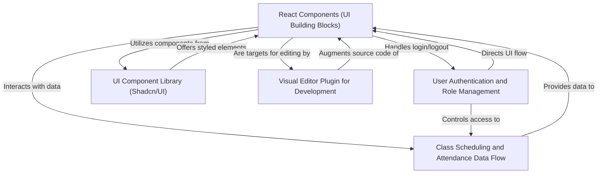
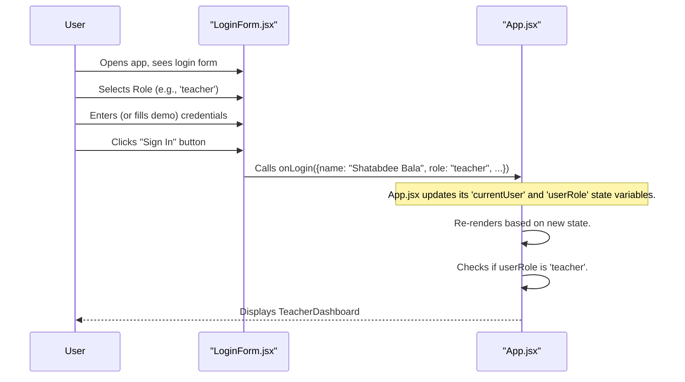
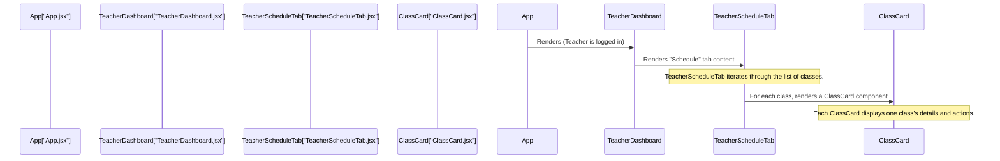
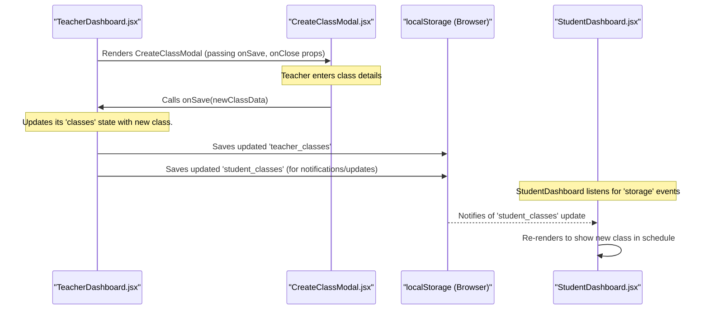
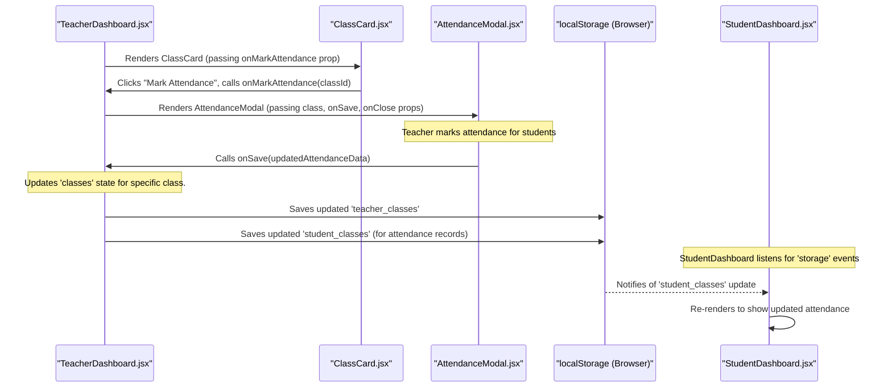
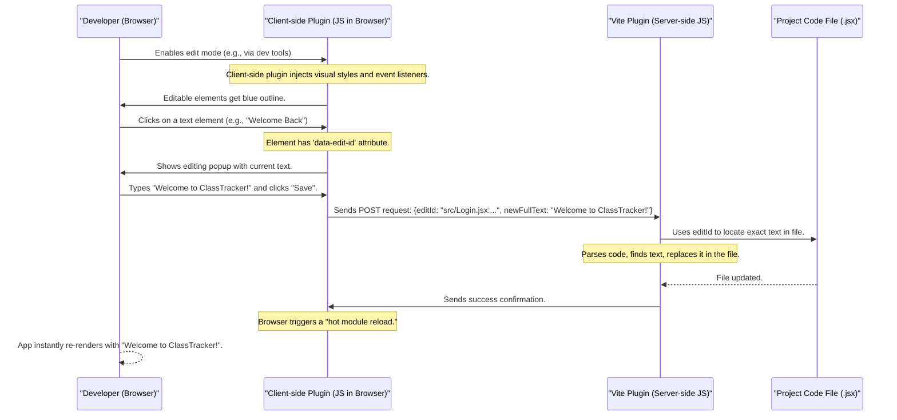

# Class-scheduling-and-attendance-management-system

This project is a **class scheduling and attendance management system** designed for both teachers and students. It allows teachers to *create and manage class schedules*, *mark student attendance*, and view analytics. Students can *view their personalized class schedules*, track their *attendance records*, and receive notifications, all through an intuitive web interface.


## Visual Overview



### Under the Hood: The Login Flow

Let's visualize the step-by-step process of logging in with a simple diagram.



### Role Capabilities in Our Application

Here's a quick look at the core differences in what a teacher and a student can do and see in our `ClassTracker` application:

| Feature/Capability      | Teacher Role                                     | Student Role                                       |
| :---------------------- | :----------------------------------------------- | :------------------------------------------------- |
| **Dashboard View**      | Teacher Dashboard (Management focus)             | Student Dashboard (Personal progress focus)        |
| **Class Management**    | Create, Edit (coming soon), Delete classes       | View their enrolled classes only                   |
| **Attendance**          | Mark attendance for students in their classes    | View their own attendance records                  |
| **Analytics/Reports**   | View overall attendance rates, student counts    | View personal attendance rate and statistics       |
| **Notifications**       | Sends class updates to students (implicitly)     | Receives reminders, schedule changes, attendance alerts |

This table clearly shows how the `userRole` dictates the entire user experience and functionality available to each individual within the application.

### Under the Hood: Component Hierarchy

Our `App.jsx` component is the parent component of almost everything. It makes the high-level decision: "Is a user logged in? If so, are they a `teacher` or a `student`?" Based on that, it renders either the `LoginForm`, `TeacherDashboard`, or `StudentDashboard`.

Each dashboard is then further broken down into more specific components. This creates a hierarchy, like a family tree, where components are nested inside one another.

Let's visualize a simplified version of this hierarchy when a teacher logs in:


**Explanation:**
1.  **`App.jsx`**: Decides to show the `TeacherDashboard` because the user's role is 'teacher'.
2.  **`TeacherDashboard.jsx`**: This is the main screen for teachers. It manages which *tab* is currently active (e.g., Schedule, Attendance, Analytics). When the "Schedule" tab is active, it renders the `TeacherScheduleTab` component.
3.  **`TeacherScheduleTab.jsx`**: This component's job is to display all the teacher's scheduled classes. It takes the list of `classes` as a prop. For each class in that list, it renders a `ClassCard` component.
4.  **`ClassCard.jsx`**: This is a smaller, reusable component whose only job is to display the details of *one single class* (like its subject, date, time) and provide actions like "Mark Attendance" or "Delete". It receives all the necessary class data as props.

This breakdown makes each file much smaller and focused on one specific task. If you want to change how a single class looks, you only need to modify `ClassCard.jsx`. If you want to change how the *list* of classes is displayed, you look at `TeacherScheduleTab.jsx`. This is the power of components!


### Under the Hood: The Complete Data Flow

Let's visualize the entire journey of data when a class is created and then attendance is marked.

#### Data Flow: Creating a New Class



#### Data Flow: Marking Attendance



### Student's Perspective: Seeing the Data

It's important to note how students see these updates. In our mock setup, the `StudentDashboard.jsx` has a special trick:

```jsx
// class scheduling course/src/components/student/StudentDashboard.jsx (Simplified)
import React, { useState, useEffect } from 'react';

export default function StudentDashboard({ user }) {
  const [classes, setClasses] = useState([]);

  useEffect(() => {
    const loadData = () => {
        // Loads classes from localStorage for the current student
        const studentClasses = JSON.parse(localStorage.getItem('student_classes')) || [];
        const enrolledClasses = studentClasses.filter(c => c.students.includes(user.name));
        setClasses(enrolledClasses);
    };

    loadData(); // Load data on initial component mount

    // Listen for changes in localStorage from other tabs/windows
    window.addEventListener('storage', loadData);
    return () => window.removeEventListener('storage', loadData); // Clean up listener
  }, [user.name]);

  // ... rest of the student dashboard ...
}
```
**Explanation:**
*   The `StudentDashboard` uses `useEffect` to *listen* for changes in `localStorage`.
*   Whenever the `TeacherDashboard` updates `student_classes` in `localStorage` (which happens when a class is created or attendance is marked), the `storage` event fires.
*   The `loadData` function is called, fetching the latest `student_classes`, filtering them for the logged-in student, and updating the `classes` state. This makes the student's schedule and attendance records automatically refresh!


### Under the Hood: How Shadcn/UI Components Work

This is a very important point about Shadcn/UI: it's not like other component libraries where you install a package, and the components are hidden inside. With Shadcn/UI, you actually **copy the component's code** directly into your project's `src/components/ui` folder.

#### Why Copy the Code? (Ownership and Control)

This "copy-paste" approach (often done through a command-line tool, not manually) is a core philosophy of Shadcn/UI:
*   **You own the code:** The components become part of *your* project. You can change them completely without waiting for library updates.
*   **Easy Customization:** Need a button to look slightly different? Just open `src/components/ui/button.jsx` and change the Tailwind classes.
*   **No dependency bloat:** You only include the components you actually use.

Let's visualize the simplified flow from using a Shadcn/UI component to what the user sees:

```mermaid
sequenceDiagram
    participant User
    participant LoginForm["LoginForm.jsx"]
    participant ShadcnButton["@/components/ui/button.jsx"]
    participant RadixUI["Radix UI Primitives"]
    participant TailwindCSS["Tailwind CSS (config/styles)"]
    participant Browser

    User->>LoginForm: Views login page
    LoginForm->>ShadcnButton: Uses <Button> component (with props like 'variant')
    ShadcnButton->>RadixUI: Leverages Radix UI for base behavior and accessibility
    ShadcnButton->>TailwindCSS: Applies Tailwind classes (defined in button.jsx)
    Note over TailwindCSS: Tailwind CSS processes classes from config and global styles.
    ShadcnButton-->>Browser: Renders a styled <button> HTML element
    Browser-->>User: Displays the visible and functional button
```

**Step-by-step walkthrough:**

1.  **User sees `LoginForm`:** The `App.jsx` ([Chapter 1: User Authentication and Role Management](01_user_authentication_and_role_management_.md)) decides to show the `LoginForm`.
2.  **`LoginForm` uses `<Button>`:** Inside `LoginForm.jsx`, we use the `<Button>` component that we imported. We pass it some props like `type`, `onClick`, and `className` (which usually contains Tailwind classes). We might also use a `variant` prop (like `variant="outline"`) that Shadcn/UI buttons understand.
3.  **`ShadcnButton` code takes over:** The code inside `src/components/ui/button.jsx` is executed.
    *   It uses `Radix UI` to provide the fundamental, accessible behavior of a button.
    *   It uses a helper called `cva` (class-variance-authority) to combine the default styles for the button, any specific styles for its `variant` (e.g., "outline"), `size`, and any *additional* `className` props we passed from `LoginForm`.
    *   These combined classes are all Tailwind CSS classes.
4.  **Tailwind CSS does its magic:** The browser's stylesheet (generated by Tailwind CSS based on `tailwind.config.js` and `src/index.css`) applies the actual visual styles (colors, spacing, shadows) corresponding to all those Tailwind classes.
5.  **Browser displays:** A fully styled and functional HTML `<button>` element appears on the screen, ready for the user to interact with.

#### Diving Deeper: The Button Component Code

Let's look at a very simplified version of the `src/components/ui/button.jsx` file to understand how it combines these ideas:

```jsx
// class scheduling course/src/components/ui/button.jsx (Simplified)
import { cn } from '@/lib/utils'; // Helper for combining class names
import { cva } from 'class-variance-authority'; // Helps manage different styles (variants)
import { Slot } from '@radix-ui/react-slot'; // Provides accessibility for underlying HTML

// 1. Define the different styles (variants, sizes) for our button
const buttonVariants = cva(
  'inline-flex items-center justify-center rounded-md text-sm font-medium transition-colors', // Base styles for ALL buttons
  {
    variants: { // How button's appearance can change
      variant: {
        default: 'bg-primary text-primary-foreground hover:bg-primary/90', // Default button style
        destructive: 'bg-destructive text-destructive-foreground', // Red button for destructive actions
        outline: 'border border-input bg-background hover:bg-accent', // Button with a border
        // ... more variants
      },
      size: { // How button's size can change
        default: 'h-10 px-4 py-2', // Normal size
        sm: 'h-9 rounded-md px-3', // Small size
        // ... more sizes
      },
    },
    defaultVariants: { // What style to use if none is specified
      variant: 'default',
      size: 'default',
    },
  }
);

// 2. The actual Button React component
const Button = React.forwardRef(({ className, variant, size, asChild = false, ...props }, ref) => {
  const Comp = asChild ? Slot : 'button'; // Use Radix Slot or a standard button HTML tag
  return (
    <Comp
      // 3. Combine all class names using our helper 'cn'
      className={cn(buttonVariants({ variant, size, className }))}
      ref={ref}
      {...props}
    />
  );
});
Button.displayName = 'Button';

export { Button, buttonVariants };
```
**Explanation:**
1.  **`buttonVariants = cva(...)`**: This function (from the `class-variance-authority` library) is a smart way to define all the possible styles for our button.
    *   The first string contains base Tailwind classes that *every* button will have.
    *   `variants` define different options: `variant` (e.g., `default`, `outline`, `destructive`) and `size` (e.g., `default`, `sm`). Each option has its own set of Tailwind classes.
    *   `defaultVariants` specifies what styles to apply if we don't pass a `variant` or `size` prop.
2.  **The `Button` component itself**: This is a standard React component. It takes `className`, `variant`, `size`, and other `props` (like `onClick`, `children`).
3.  **`className={cn(buttonVariants({ variant, size, className }))}`**: This is the magic line!
    *   `buttonVariants({ variant, size, className })` calculates all the relevant Tailwind classes based on the `variant` and `size` props, *and* any extra `className` we passed from `LoginForm`.
    *   The `cn` helper function (from `src/lib/utils.js`) then intelligently merges all these class names, making sure there are no conflicts or duplicates.

#### The `cn` Utility

The `cn` utility is a simple but powerful helper function used throughout Shadcn/UI (and many Tailwind projects) to safely combine multiple CSS class strings:

```javascript
// class scheduling course/src/lib/utils.js
import { clsx } from 'clsx';
import { twMerge } from 'tailwind-merge';

export function cn(...inputs) {
	return twMerge(clsx(inputs));
}
```
**Explanation:**
*   `clsx`: This is a small utility that lets you easily define conditional CSS classes (e.g., `clsx('button', { 'is-active': isActive })`).
*   `twMerge`: This utility (from `tailwind-merge`) solves a common problem where multiple Tailwind classes might try to apply conflicting styles (e.g., `p-4` and `p-6`). `twMerge` intelligently resolves these conflicts, ensuring the *last* or most specific class takes precedence.

Together, `clsx` and `twMerge` in the `cn` function ensure that our Shadcn/UI components always render with the correct and optimized set of Tailwind classes.

#### Theming with `tailwind.config.js` and `src/index.css`

The overall "look" of our `ClassTracker` application, especially its dark theme, purple-pink gradients, and rounded corners, is defined in two key places:

1.  **`tailwind.config.js`**: This file customizes Tailwind's default settings. For example, it defines our `primary`, `secondary`, `destructive` colors based on CSS variables.

    ```javascript
    // class scheduling course/tailwind.config.js (excerpt)
    /** @type {import('tailwindcss').Config} */
    module.exports = {
        // ...
        theme: {
            extend: {
                colors: {
                    border: 'hsl(var(--border))',
                    // ... other base colors ...
                    primary: {
                        DEFAULT: 'hsl(var(--primary))',
                        foreground: 'hsl(var(--primary-foreground))',
                    },
                    // ... other custom colors like purple, pink from gradient
                },
                borderRadius: {
                    lg: 'var(--radius)', // Using CSS variables for consistency
                    // ...
                },
                // ... animations for toasts, etc.
            },
        },
        plugins: [require('tailwindcss-animate')],
    };
    ```

2.  **`src/index.css`**: This is our main CSS file. It defines the actual values for the CSS variables used in `tailwind.config.js` (like `--primary` and `--background`), sets the global font, and applies the beautiful background gradient and custom scrollbar styles that you see throughout the app.

    ```css
    /* class scheduling course/src/index.css (excerpt) */

    /* Define our custom colors using HSL values */
    :root {
      --background: 222.2 84% 4.9%; /* Very dark blue for background */
      --foreground: 210 40% 98%;   /* Light color for text */
      --primary: 210 40% 98%;      /* Light color for primary actions */
      --primary-foreground: 222.2 84% 4.9%; /* Dark text on primary */
      /* ... other color variables ... */
      --radius: 0.5rem; /* For rounded corners */
    }

    /* Apply global styles and gradients */
    body {
      background: linear-gradient(135deg, #667eea 0%, #764ba2 100%); /* Our cool background gradient! */
      background-attachment: fixed;
      font-family: 'Inter', sans-serif; /* A nice, modern font */
      color: hsl(var(--foreground)); /* Use our defined foreground color */
      min-height: 100vh;
    }

    /* ... custom scrollbar and glassmorphism effect styles ... */
    ```
These files work together to ensure that any Shadcn/UI component we use automatically adopts the consistent theme and styling of our `ClassTracker` application.

### Under the Hood: How the Visual Editor Works

This "magic" happens through a few different parts working together:

#### The Overall Flow: Click, Edit, Save

Here's a simplified step-by-step of what happens when you use the visual editor:



#### Plugin Components

Our `ClassTracker` project uses a set of files in the `plugins/visual-editor/` directory to implement this.

1.  **Adding `data-edit-id` to JSX Elements (`vite-plugin-react-inline-editor.js`)**
    This is a **Vite plugin** that runs on your development server. Its job is to look at your React (`.jsx`) files *before* they are sent to the browser. It automatically adds the `data-edit-id` attribute (containing the file path, line, and column) to JSX elements that contain simple text, making them "editable" for the client-side plugin.

    ```javascript
    // class scheduling course/plugins/visual-editor/vite-plugin-react-inline-editor.js (Simplified)
    import traverseBabel from '@babel/traverse';
    import generate from '@babel/generator';
    import * as t from '@babel/types';
    import path from 'path';

    // ... (utility functions like parseEditId, checkTagNameEditable) ...

    export default function inlineEditPlugin() {
      return {
        name: 'vite-inline-edit-plugin',
        transform(code, id) {
          // Only process JSX/TSX files and skip node_modules
          if (!/\.(jsx|tsx)$/.test(id) || id.includes('node_modules')) return null;

          const relativeFilePath = path.relative(VITE_PROJECT_ROOT, id).split(path.sep).join('/');

          const babelAst = parse(code, { plugins: ['jsx', 'typescript'] }); // Parse code into an AST

          traverseBabel.default(babelAst, {
            JSXOpeningElement(path) {
              const openingNode = path.node;
              if (!openingNode.loc) return; // Skip elements without location info

              // Simplify: Only add data-edit-id if it's a simple text-holding tag
              if (checkTagNameEditable(openingNode, EDITABLE_HTML_TAGS)) {
                // Construct the unique ID
                const line = openingNode.loc.start.line;
                const column = openingNode.loc.start.column + 1;
                const editId = `${relativeFilePath}:${line}:${column}`;

                // Create and add the data-edit-id attribute
                const idAttribute = t.jsxAttribute(t.jsxIdentifier('data-edit-id'), t.stringLiteral(editId));
                openingNode.attributes.push(idAttribute);
              }
            }
          });

          // Convert the modified AST back to code
          const output = generate.default(babelAst, {}, code);
          return { code: output.code, map: output.map };
        },

        // This method handles the POST request from the client to apply edits to the file system.
        configureServer(server) {
          server.middlewares.use('/api/apply-edit', async (req, res, next) => {
            // ... (code to parse request, locate file, update text, save file) ...
            // This is where the magic of writing to your actual .jsx file happens!
          });
        }
      };
    }
    ```
    **Explanation:**
    *   The `transform` method is the heart of this plugin. It takes your `.jsx` code and uses a tool called Babel to turn it into an "Abstract Syntax Tree" (AST), which is like a map of your code's structure.
    *   It then "traverses" (walks through) this map, looking for `JSXOpeningElement` (like `<h1>`, `<p>`).
    *   If it finds a suitable element, it calculates its exact `editId` (file:line:column) and adds it as a `data-edit-id` attribute to that element.
    *   Finally, it turns the modified AST back into JavaScript code, which the browser receives.
    *   The `configureServer` method defines an API endpoint (`/api/apply-edit`) that listens for save requests from the browser. When a request comes in, it uses the `editId` to find the original file and modify its content directly on your computer's file system!

2.  **Handling Interaction and the Popup (`edit-mode-script.js`)**
    This is a plain JavaScript file that gets injected directly into your browser by another Vite plugin (`vite-plugin-edit-mode.js`). It's the client-side part that runs in your browser and lets you interact with the visual editor.

    ```javascript
    // class scheduling course/plugins/visual-editor/edit-mode-script.js (Simplified)
    // ... (imports for popup styles, config) ...

    let popupElement = null; // The popup window itself
    let currentEditingInfo = null; // Stores info about the element being edited

    function createPopup() {
      // Creates the HTML structure for the editing popup and adds it to the page.
      // Attaches event listeners for "Save" and "Cancel" buttons.
    }

    function showPopup(targetElement, editId, currentText) {
      if (!popupElement) createPopup();
      currentEditingInfo = { editId, targetElement }; // Remember what we're editing
      popupTextarea.value = currentText; // Put current text in the editor
      popupElement.classList.add('is-active'); // Show the popup
      popupTextarea.focus();
    }

    function hidePopup() {
      // Hides the popup.
    }

    function handleGlobalEvent(event) {
      // This runs whenever you click or interact with the page.
      const editableElement = event.target.closest('[data-edit-id]'); // Find the clicked editable element

      if (editableElement && event.type === 'click') {
        const editId = editableElement.getAttribute('data-edit-id');
        const currentText = editableElement.textContent || '';
        showPopup(editableElement, editId, currentText); // Show the popup for editing
        event.preventDefault(); // Stop other click actions
      } else if (!editableElement && !event.target.closest('#inline-editor-popup')) {
        hidePopup(); // If clicked outside, hide the popup
      }
    }

    async function handlePopupSave() {
      if (!currentEditingInfo) return;
      const newText = popupTextarea.value;
      const { editId } = currentEditingInfo;

      // Send the new text and editId to the server (our Vite plugin)
      const response = await fetch('/api/apply-edit', {
        method: 'POST',
        headers: { 'Content-Type': 'application/json' },
        body: JSON.stringify({ editId: editId, newFullText: newText }),
      });

      // After saving, hide the popup
      hidePopup();
    }

    function enableEditMode() {
      // Adds event listeners (like 'click') to the document to detect interactions.
      document.addEventListener('click', handleGlobalEvent, true);
      // Injects styling to show outlines on editable elements.
    }

    function disableEditMode() {
      // Removes event listeners and hides any active popups/outlines.
    }

    window.addEventListener("message", function(event) {
      // Listens for messages from a parent window (e.g., a dev environment)
      // to enable or disable the edit mode.
      if (event.data?.type === "enable-edit-mode") enableEditMode();
      if (event.data?.type === "disable-edit-mode") disableEditMode();
    });
    ```
    **Explanation:**
    *   `createPopup`, `showPopup`, `hidePopup`: These manage the visual popup editor that appears when you click on editable text.
    *   `handleGlobalEvent`: This is a "global listener" that watches for clicks anywhere on the page. If you click an element with `data-edit-id`, it triggers `showPopup`. If you click elsewhere, it hides the popup.
    *   `handlePopupSave`: When you click "Save" in the popup, this function takes the new text, combines it with the `editId` of the element you were editing, and sends it to the server using a `fetch` request to the `/api/apply-edit` endpoint (which is handled by `vite-plugin-react-inline-editor.js`).

3.  **Styles and Templates (`visual-editor-config.js`)**
    This file holds the CSS styles for the editing popup and the blue dashed outlines you see around editable elements. It also provides a simple HTML template for the popup.

    ```javascript
    // class scheduling course/plugins/visual-editor/visual-editor-config.js (Simplified)
    export const POPUP_STYLES = `
    #inline-editor-popup {
      position: fixed;
      z-index: 10000;
      background: #161718;
      /* ... other styling for the popup ... */
      display: none; /* Hidden by default */
    }

    #inline-editor-popup.is-active {
      display: flex; /* Show when active */
    }

    #inline-editor-popup textarea {
      /* ... styling for the text input area ... */
    }

    #inline-editor-popup .save-button {
      background: #673de6; /* Purple button */
      color: white;
    }
    `;

    export function getPopupHTMLTemplate(saveLabel, cancelLabel) {
      return `
        <textarea></textarea>
        <div class="button-container">
          <button class="popup-button cancel-button">${cancelLabel}</button>
          <button class="popup-button save-button">${saveLabel}</button>
        </div>
      `;
    };

    export const EDIT_MODE_STYLES = `
      #root[data-edit-mode-enabled="true"] [data-edit-id] {
        cursor: pointer;
        outline: 1px dashed #357DF9; /* Blue dashed outline for editable elements */
        outline-offset: 2px;
      }
      #root[data-edit-mode-enabled="true"] [data-edit-id]:hover {
        background-color: #357DF933; /* Light blue background on hover */
      }
    `;
    ```
    **Explanation:**
    *   `POPUP_STYLES`: Defines how the editing popup itself looks (its background, borders, colors, how it appears and disappears).
    *   `getPopupHTMLTemplate`: A simple function to generate the HTML for the popup's internal elements (the `textarea` and the "Save"/"Cancel" buttons).
    *   `EDIT_MODE_STYLES`: Defines the visual cues for editable elements, like the blue dashed outline and the hover effect, which appear when the edit mode is active.

4.  **Integrating the Plugins (`vite.config.js`)**
    Finally, these plugins need to be told to run. This happens in the `vite.config.js` file, which is the configuration file for Vite (our development server). The plugins are usually only enabled when running in development mode.

    ```javascript
    // class scheduling course/vite.config.js (Simplified)
    import react from '@vitejs/plugin-react';
    import { defineConfig } from 'vite';

    const isDev = process.env.NODE_ENV !== 'production';
    let inlineEditPlugin, editModeDevPlugin;

    if (isDev) {
        // Dynamically import the visual editor plugins only in development
        inlineEditPlugin = (await import('./plugins/visual-editor/vite-plugin-react-inline-editor.js')).default;
        editModeDevPlugin = (await import('./plugins/visual-editor/vite-plugin-edit-mode.js')).default;
    }

    export default defineConfig({
        plugins: [
            ...(isDev ? [inlineEditPlugin(), editModeDevPlugin()] : []), // Add plugins if in dev mode
            react(), // The standard React plugin
            // ... other plugins
        ],
        // ... other Vite configurations
    });
    ```
    **Explanation:**
    *   The `if (isDev)` block ensures that our visual editor plugins are only loaded and active when the `NODE_ENV` is not 'production' (i.e., when you are developing the app).
    *   The `plugins` array then includes `inlineEditPlugin()` and `editModeDevPlugin()`. This tells Vite to use these plugins to enhance our development experience.
